# daisyUI — Componentes Semánticos para Tailwind

## 🎯 Objetivos

- Entender qué es daisyUI y cómo se diferencia de Tailwind puro
- Instalar y configurar daisyUI como plugin de Tailwind
- Usar los componentes más importantes: btn, card, form, modal, table
- Cambiar y personalizar temas con CSS variables

---



---

## 1. ¿Qué es daisyUI?

daisyUI es un **plugin de TailwindCSS** que agrega clases semánticas de componentes. En lugar de escribir 20 clases para un botón, escribes `btn btn-primary`.

```html
<!-- ❌ Tailwind puro — verboso para componentes complejos -->
<button class="inline-flex items-center justify-center px-4 py-2
               bg-blue-600 hover:bg-blue-700 text-white font-medium
               rounded-lg shadow-sm transition-colors duration-200
               focus-visible:ring-2 focus-visible:ring-blue-500 focus-visible:ring-offset-2
               disabled:opacity-50 disabled:cursor-not-allowed">
  Enviar formulario
</button>

<!-- ✅ daisyUI — semántico y conciso -->
<button class="btn btn-primary">Enviar formulario</button>
```

### daisyUI vs. otras opciones

| | daisyUI | shadcn/ui | Tailwind puro |
|---|---|---|---|
| **Qué es** | Plugin Tailwind | Componentes copiados | Solo utilidades |
| **Curva de aprendizaje** | Baja | Media | Alta inicial |
| **Personalización** | Via CSS variables | Edita el archivo copiado | Total |
| **Accesibilidad** | Básica | Alta (Radix UI) | Manual |
| **Ideal para** | Prototipos rápidos | Apps production-ready | Control total |

---

## 2. Instalación

```bash
# En proyectos con Vite + Tailwind ya configurado
pnpm add -D daisyui

# O con npm
npm install -D daisyui
```

```javascript
// tailwind.config.js — registrar daisyUI como plugin de Tailwind
module.exports = {
  content: ['./index.html', './src/**/*.{html,js,jsx}'],
  plugins: [
    require('daisyui'),
  ],
  daisyui: {
    themes: ['light', 'dark', 'cupcake', 'business'],  // Temas disponibles
    defaultTheme: 'light',
  },
}
```

El CDN incluye daisyUI si lo solicitas:

```html
<!-- CDN con daisyUI para ejercicios/prototipos -->
<link href="https://cdn.jsdelivr.net/npm/daisyui@4/dist/full.min.css" rel="stylesheet"/>
<script src="https://cdn.tailwindcss.com"></script>
```

---

## 3. Sistema de Temas

daisyUI usa **CSS variables** para sus colores. Cambiar de tema es tan simple como cambiar el atributo `data-theme` del `<html>`:

```html
<!-- Aplica el tema light a toda la página -->
<html data-theme="light">

<!-- Cambia a dark -->
<html data-theme="dark">

<!-- Usa cualquier tema predefinido de daisyUI -->
<html data-theme="cupcake">   <!-- pasteles -->
<html data-theme="business">  <!-- oscuro profesional -->
<html data-theme="synthwave"> <!-- neón retro -->
```

### Toggle de tema con JS

```javascript
// Toggle entre light y dark
const toggle = document.getElementById('theme-toggle')
toggle.addEventListener('click', () => {
  const current = document.documentElement.getAttribute('data-theme')
  document.documentElement.setAttribute('data-theme', current === 'dark' ? 'light' : 'dark')
})
```

### Crear un tema personalizado

```javascript
// tailwind.config.js
daisyui: {
  themes: [
    {
      'mi-marca': {
        'primary':          '#0ea5e9',    // sky-500
        'primary-content':  '#ffffff',
        'secondary':        '#818cf8',    // violet-400
        'accent':           '#34d399',    // emerald-400
        'neutral':          '#1f2937',    // gray-800
        'base-100':         '#030712',    // gray-950 (background)
        'base-200':         '#111827',    // gray-900
        'base-300':         '#1f2937',    // gray-800
        'base-content':     '#f9fafb',    // gray-50 (texto principal)
      },
    },
    'light',
    'dark',
  ],
},
```

---

## 4. Componentes Principales

### Botones: `btn`

```html
<!-- Variantes de estilo -->
<button class="btn">Default</button>
<button class="btn btn-primary">Primary</button>
<button class="btn btn-secondary">Secondary</button>
<button class="btn btn-accent">Accent</button>
<button class="btn btn-ghost">Ghost</button>
<button class="btn btn-outline">Outline</button>
<button class="btn btn-link">Link</button>

<!-- Variantes de estado -->
<button class="btn btn-primary btn-disabled">Disabled</button>
<button class="btn btn-primary loading">Loading...</button>

<!-- Tamaños -->
<button class="btn btn-xs">Extra small</button>
<button class="btn btn-sm">Small</button>
<button class="btn btn-md">Medium (default)</button>
<button class="btn btn-lg">Large</button>
```

### Cards: `card`

```html
<div class="card w-96 bg-base-100 shadow-xl">
  <figure>
    
  </figure>
  <div class="card-body">
    <h2 class="card-title">
      Mi Proyecto
      <div class="badge badge-secondary">Nuevo</div>
    </h2>
    <p class="text-base-content/70">Descripción del proyecto...</p>
    <div class="card-actions justify-end">
      <button class="btn btn-primary">Ver más</button>
    </div>
  </div>
</div>
```

### Formularios

```html
<!-- Input -->
<label class="form-control w-full">
  <div class="label">
    <span class="label-text">Nombre</span>
  </div>
  <input type="text" placeholder="Tu nombre" class="input input-bordered w-full"/>
</label>

<!-- Select -->
<select class="select select-bordered w-full">
  <option disabled selected>Elige una opción</option>
  <option>React</option>
  <option>Next.js</option>
  <option>Vue</option>
</select>

<!-- Textarea -->
<textarea class="textarea textarea-bordered w-full" placeholder="Tu mensaje"></textarea>

<!-- Checkbox y toggle -->
<input type="checkbox" class="checkbox checkbox-primary"/>
<input type="checkbox" class="toggle toggle-primary"/>
```

### Tabla: `table`

```html
<div class="overflow-x-auto">
  <table class="table table-zebra">
    <thead>
      <tr>
        <th>#</th>
        <th>Nombre</th>
        <th>Tecnología</th>
        <th>Estado</th>
      </tr>
    </thead>
    <tbody>
      <tr>
        <td>1</td>
        <td>Portfolio</td>
        <td>React + Tailwind</td>
        <td><span class="badge badge-success">Publicado</span></td>
      </tr>
      <tr>
        <td>2</td>
        <td>Dashboard</td>
        <td>Next.js + shadcn</td>
        <td><span class="badge badge-warning">En progreso</span></td>
      </tr>
    </tbody>
  </table>
</div>
```

### Navbar

```html
<div class="navbar bg-base-100 shadow-sm">
  <div class="navbar-start">
    <a class="btn btn-ghost text-xl font-bold">Mi Portfolio</a>
  </div>
  <div class="navbar-center hidden lg:flex">
    <ul class="menu menu-horizontal px-1">
      <li><a>Inicio</a></li>
      <li><a>Proyectos</a></li>
      <li><a>Contacto</a></li>
    </ul>
  </div>
  <div class="navbar-end">
    <button class="btn btn-primary btn-sm">Contrátame</button>
  </div>
</div>
```

### Modal

```html
<!-- Trigger -->
<button class="btn btn-primary" onclick="modal_demo.showModal()">Abrir modal</button>

<!-- Modal -->
<dialog id="modal_demo" class="modal">
  <div class="modal-box">
    <h3 class="font-bold text-lg">¡Éxito!</h3>
    <p class="py-4">Tu formulario fue enviado correctamente.</p>
    <div class="modal-action">
      <form method="dialog">
        <button class="btn">Cerrar</button>
      </form>
    </div>
  </div>
</dialog>
```

### Badge y Alert

```html
<!-- Badges -->
<span class="badge badge-primary">Primary</span>
<span class="badge badge-success">Aprobado</span>
<span class="badge badge-warning">Pendiente</span>
<span class="badge badge-error">Error</span>

<!-- Alerts -->
<div role="alert" class="alert alert-success">
  <svg xmlns="http://www.w3.org/2000/svg" class="h-6 w-6 shrink-0 stroke-current" fill="none" viewBox="0 0 24 24">
    <path stroke-linecap="round" stroke-linejoin="round" stroke-width="2" d="M9 12l2 2 4-4m6 2a9 9 0 11-18 0 9 9 0 0118 0z"/>
  </svg>
  <span>Cambios guardados correctamente.</span>
</div>
```

---

## 5. Mezclar daisyUI con Tailwind

Las clases de daisyUI y Tailwind se pueden combinar libremente:

```html
<!-- Personalizar encima de daisyUI con Tailwind -->
<button class="btn btn-primary px-8 rounded-full text-lg font-bold shadow-lg
               hover:scale-105 transition-transform motion-safe:hover:scale-105">
  Contáctame
</button>

<!-- Card con overlay y gradient de Tailwind -->
<div class="card overflow-hidden group">
  <figure class="relative">
    
    <div class="absolute inset-0 bg-gradient-to-t from-black/60 to-transparent opacity-0 group-hover:opacity-100 transition-opacity duration-300"/>
  </figure>
  <div class="card-body">
    <h2 class="card-title text-base-content">Proyecto</h2>
  </div>
</div>
```

---

## ✅ Checklist de Verificación

- [ ] daisyUI instalado como plugin en `tailwind.config.js`
- [ ] Tema configurado con `data-theme` en `<html>`
- [ ] Toggle de tema funcional entre light y dark
- [ ] Formulario con input, select y checkbox daisyUI
- [ ] Tabla con `table-zebra`
- [ ] Navbar con `navbar-start/center/end`
- [ ] Al menos 1 badge y 1 alert

---

## 📚 Recursos

- [daisyUI Documentation](https://daisyui.com/components/)
- [daisyUI Themes](https://daisyui.com/docs/themes/)
- [daisyUI Theme Generator](https://daisyui.com/theme-generator/)
