# shadcn/ui — Componentes que Pertenecen a tu Proyecto

## 🎯 Objetivos

- Entender el modelo único de shadcn/ui: componentes copiados, no dependencia
- Instalar shadcn/ui en un proyecto Next.js con la CLI
- Usar y personalizar los componentes más comunes: Button, Card, Input, Dialog
- Combinar shadcn/ui con Tailwind para crear UIs production-ready

---



---

## 1. ¿Qué es shadcn/ui?

shadcn/ui NO es una librería estándar de npm. Es una **colección de componentes que se copian directamente a tu proyecto** usando una CLI:

```bash
# shadcn/ui copia el componente a TU proyecto
npx shadcn@latest add button

# El resultado: tienes el archivo en tu código
# components/ui/button.tsx  ← es TUYO, puedes editarlo
```

### La filosofía detrás de shadcn/ui

| Librería tradicional | shadcn/ui |
|---|---|
| `npm install ui-library` | `npx shadcn add button` |
| Componente en `node_modules` (no lo puedes editar) | Componente en `components/ui/` (lo puedes editar) |
| Actualización → `npm update` | Actualización → reemplazar el archivo copiado |
| Menos control sobre el código | Control total |

### Stack de shadcn/ui

- **Radix UI**: Componentes headless con accesibilidad completa (ARIA, keyboard nav)
- **TailwindCSS**: Todos los estilos en clases Tailwind
- **`cn()` helper**: `clsx` + `tailwind-merge` para variantes y overrides

---

## 2. Instalación en Next.js

```bash
# En un proyecto Next.js recién creado o existente
npx shadcn@latest init
```

El wizard de `init` te preguntará:

```
✔ Which style would you like to use? › Default (New York es más compacto)
✔ Which color would you like to use as the base color? › Slate (o Zinc, Gray, etc.)
✔ Would you like to use CSS variables for theming? › Yes
```

Archivos que crea/modifica `init`:
- `components.json` — configuración de shadcn
- `lib/utils.ts` — crea el helper `cn()`
- `app/globals.css` — agrega CSS variables para el tema
- `tailwind.config.ts` — actualiza con los tokens del tema

---

## 3. Agregar componentes con la CLI

```bash
# Agregar componentes individuales
npx shadcn@latest add button
npx shadcn@latest add card
npx shadcn@latest add input
npx shadcn@latest add dialog
npx shadcn@latest add badge

# Agregar múltiples a la vez
npx shadcn@latest add button card input dialog badge

# Ver todos los componentes disponibles
npx shadcn@latest add
```

Cada componente se copia a `components/ui/`:

```
components/
└── ui/
    ├── button.tsx
    ├── card.tsx
    ├── input.tsx
    ├── dialog.tsx
    └── badge.tsx
```

---

## 4. Usando los componentes

### Button

```jsx
import { Button } from '@/components/ui/button'

// Variantes predefinidas
<Button>Default</Button>
<Button variant="secondary">Secondary</Button>
<Button variant="destructive">Eliminar</Button>
<Button variant="outline">Outline</Button>
<Button variant="ghost">Ghost</Button>
<Button variant="link">Link</Button>

// Tamaños
<Button size="sm">Pequeño</Button>
<Button size="default">Normal</Button>
<Button size="lg">Grande</Button>
<Button size="icon"><SearchIcon /></Button>

// Con className para personalizar (tailwind-merge maneja conflictos)
<Button className="w-full rounded-full bg-sky-500 hover:bg-sky-600">
  Contrátame
</Button>
```

### Card

```jsx
import {
  Card,
  CardHeader,
  CardTitle,
  CardDescription,
  CardContent,
  CardFooter,
} from '@/components/ui/card'

<Card className="w-80">
  <CardHeader>
    <CardTitle>Portfolio Dashboard</CardTitle>
    <CardDescription>Resumen de tus proyectos publicados</CardDescription>
  </CardHeader>
  <CardContent>
    <p className="text-3xl font-bold">12 proyectos</p>
    <p className="text-sm text-muted-foreground mt-1">4 en producción</p>
  </CardContent>
  <CardFooter className="flex justify-between">
    <Button variant="outline" size="sm">Ver todos</Button>
    <Button size="sm">Agregar nuevo</Button>
  </CardFooter>
</Card>
```

### Input y Form

```jsx
import { Input } from '@/components/ui/input'
import { Label } from '@/components/ui/label'

<div className="space-y-2">
  <Label htmlFor="email">Email</Label>
  <Input
    id="email"
    type="email"
    placeholder="nombre@ejemplo.com"
    className="focus-visible:ring-sky-500"
  />
</div>
```

### Dialog (Modal)

```jsx
import {
  Dialog,
  DialogContent,
  DialogDescription,
  DialogHeader,
  DialogTitle,
  DialogTrigger,
  DialogFooter,
} from '@/components/ui/dialog'

<Dialog>
  <DialogTrigger asChild>
    <Button>Ver detalles del proyecto</Button>
  </DialogTrigger>
  <DialogContent className="sm:max-w-md">
    <DialogHeader>
      <DialogTitle>Proyecto: Portfolio</DialogTitle>
      <DialogDescription>
        Stack: Next.js 15 + Tailwind v4 + shadcn/ui
      </DialogDescription>
    </DialogHeader>
    <div className="py-4">
      <p className="text-sm text-muted-foreground">
        Descripción detallada del proyecto...
      </p>
    </div>
    <DialogFooter>
      <Button variant="outline">Cerrar</Button>
      <Button>Ver en GitHub</Button>
    </DialogFooter>
  </DialogContent>
</Dialog>
```

### Badge

```jsx
import { Badge } from '@/components/ui/badge'

<Badge>Default</Badge>
<Badge variant="secondary">React</Badge>
<Badge variant="destructive">Deprecated</Badge>
<Badge variant="outline">TypeScript</Badge>
```

---

## 5. El sistema de colores/temas

shadcn/ui usa CSS variables semánticas en `globals.css`. Todas hacen referencia a valores HSL:

```css
/* app/globals.css — variables del tema light */
:root {
  --background: 0 0% 100%;         /* blanco */
  --foreground: 222.2 84% 4.9%;    /* casi negro */
  --primary: 222.2 47.4% 11.2%;    /* azul oscuro */
  --primary-foreground: 210 40% 98%;
  --muted: 210 40% 96.1%;
  --muted-foreground: 215.4 16.3% 46.9%;
  --border: 214.3 31.8% 91.4%;
  --ring: 222.2 84% 4.9%;
  /* ... */
}

/* Dark mode */
.dark {
  --background: 222.2 84% 4.9%;
  --foreground: 210 40% 98%;
  --primary: 210 40% 98%;
  --primary-foreground: 222.2 47.4% 11.2%;
  /* ... */
}
```

Para personalizar el tema, cambia estas variables CSS — los componentes se actuallizan automáticamente:

```css
/* Cambiar el color primario a sky */
:root {
  --primary: 199 89% 48%;           /* sky-500 */
  --primary-foreground: 0 0% 100%;  /* blanco */
  --ring: 199 89% 48%;              /* sky-500 para focus rings */
}
```

---

## 6. Personalizar un componente

Cuando copias un componente, es **tuyo** — puedes editarlo directamente:

```tsx
// components/ui/button.tsx — antes de personalizar
const buttonVariants = cva(
  "inline-flex items-center justify-center whitespace-nowrap rounded-md text-sm font-medium ring-offset-background transition-colors focus-visible:outline-none focus-visible:ring-2 focus-visible:ring-ring focus-visible:ring-offset-2 disabled:pointer-events-none disabled:opacity-50",
  {
    variants: {
      variant: {
        default: "bg-primary text-primary-foreground hover:bg-primary/90",
        // ...
      },
      // ...
    },
  }
)

// Agregar una variante custom: brand
// Solo añadir en el objeto variants:
      brand: "bg-sky-500 text-white hover:bg-sky-600 shadow-sky-500/25 shadow-md",
```

---

## ✅ Checklist de Verificación

- [ ] `npx shadcn@latest init` ejecutado correctamente
- [ ] `components/ui/` con al menos 4 componentes: Button, Card, Input, Badge
- [ ] `lib/utils.ts` con helper `cn()`
- [ ] CSS variables del tema en `globals.css`
- [ ] Página usando Button, Card y Badge importados de `@/components/ui`
- [ ] Al menos 1 componente personalizado (variante nueva o estilo modificado)

---

## 📚 Recursos

- [shadcn/ui Documentation](https://ui.shadcn.com/)
- [shadcn/ui Components](https://ui.shadcn.com/components)
- [Radix UI (base de shadcn)](https://www.radix-ui.com/)
- [shadcn Themes](https://ui.shadcn.com/themes)
